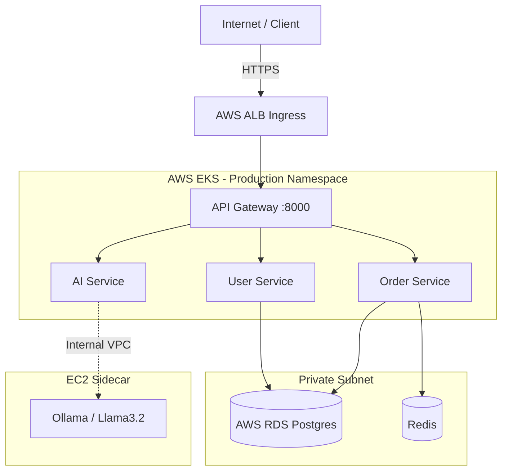

# 🚀 Cloud-Native AI Microservices Platform


A complete, end-to-end DevOps portfolio project demonstrating how to containerize, orchestrate, and automate the deployment of a modern microservices architecture. 

This project takes 4 Python (FastAPI) microservices—including a locally hosted AI engine—and deploys them from a local `docker-compose` environment into a production-grade AWS Elastic Kubernetes Service (EKS) cluster using Terraform, Helm, and GitHub Actions.

---

## 🌟 Key DevOps Skills Demonstrated

I built this project to showcase hands-on experience with modern cloud-native tools and practices:

- **Infrastructure as Code (Terraform):** Provisioned a complete AWS environment from scratch, including a custom VPC, an EKS cluster with Spot Instances (for cost savings), an RDS PostgreSQL database, and ECR repositories. Implemented **remote state locking via S3 and DynamoDB** to ensure safe team collaboration.
- **CI/CD Automation (GitHub Actions):** Designed an automated pipeline that builds Docker images, runs unit tests, and deploys to Kubernetes.
- **Security & IAM (OIDC & Trivy):** Configured GitHub Actions to authenticate securely to AWS using OpenID Connect (OIDC) instead of static keys. Integrated Trivy into the pipeline to scan containers and automatically block deployments if critical vulnerabilities are found.
- **Kubernetes Orchestration (Helm & EKS):** Packaged the microservices into a unified Helm chart. Implemented Horizontal Pod Autoscalers (HPA), ClusterIP internal routing, and an AWS Application Load Balancer (ALB) via Ingress.
- **Automated Database Migrations:** Designed a Kubernetes Job using Helm Hooks (`pre-install`) to automatically initialize the AWS RDS PostgreSQL schema during CI/CD deployments without exposing the database to the internet.
- **Microservices Data Flow:** Implemented Database Connection Pooling (`psycopg2.pool`) for PostgreSQL to prevent connection exhaustion and dramatically reduce latency, alongside a Redis cache to optimize frequent database reads.

---

## 🏗️ Architecture

### 1. Cloud Deployment (AWS EKS)
External traffic is routed through an AWS ALB into the EKS cluster. The backend microservices run in isolated private subnets, talking securely to an AWS RDS instance and an EC2-hosted LLM (Llama 3.2).



### 2. Local Development
For local testing, the entire stack (including the AI model, database, and cache) spins up instantly using a single `docker-compose up` command, ensuring perfect parity with the cloud environment.

---

## 🛠️ Technology Stack

| Category | Tools Used |
| :--- | :--- |
| **Cloud Provider** | Amazon Web Services (AWS) |
| **Infrastructure as Code** | Terraform (~> 5.0) |
| **Containerization** | Docker, Docker Compose |
| **Kubernetes / Routing** | AWS EKS (v1.36), Helm v3, AWS ALB Ingress Controller |
| **CI/CD Pipeline** | GitHub Actions |
| **Security Scanning** | Trivy |
| **Backend & Data** | Python 3.11, FastAPI, PostgreSQL 15 (RDS), Redis 7 |
| **AI Integration** | Ollama (`llama3.2:1b` model) |

---

## 🚀 Quick Start (Local Setup)

Want to see it run? You can spin up the entire microservices architecture on your local machine.
*(Requires Docker Desktop v24+ and 8GB RAM)*

```bash
# 1. Clone the repository
git clone <repo-url>
cd microservices-platform

# 2. Run the automated setup script
bash scripts/setup.sh
```

**Verify it's working:**
```bash
# Check if the API Gateway is healthy
curl http://localhost:8000/health

# Ask the AI to query the database!
curl -s -X POST http://localhost:8000/ai/query \
  -H 'Content-Type: application/json' \
  -d '{"query": "Show me all orders over 5000"}'
```

---

## ☁️ Cloud Deployment (AWS EKS)

This project is fully automated for cloud deployment using a GitOps-style push model. 

For a complete, step-by-step guide on how I provisioned the AWS infrastructure with Terraform and configured the OIDC pipeline, please check out my detailed **[Run Guide & Runbook](./RUN_GUIDE.md)**.

### How the CI/CD Pipeline Works
Whenever code is pushed to the `main` branch, GitHub Actions takes over:
1. **Parallel Testing:** Runs `pytest` on all microservices simultaneously.
2. **Build & Scan:** Builds the Docker images and scans them for CVEs using **Trivy**.
3. **Registry Push:** Authenticates to AWS via OIDC and pushes images to Amazon ECR.
4. **Helm Deployment:** Runs a `helm upgrade` against the EKS cluster to deploy the new microservices, rolling back automatically if health checks fail.

---

## 📂 Repository Structure
```text
.
├── .github/workflows/deploy.yaml   # Full CI/CD Pipeline
├── api-gateway/                    # Entrypoint microservice (FastAPI)
├── ai-service/                     # AI Orchestration layer
├── user-service/                   # Core business logic (PostgreSQL)
├── order-service/                  # Core business logic (Redis Cache)
├── terraform/                      # AWS IaC (VPC, EKS, RDS, ECR)
├── helm/ai-platform/               # Unified Kubernetes Helm Chart
├── plans/                          # Documentation & Runbooks
└── scripts/                        # Automation & Bootstrap utilities
```
