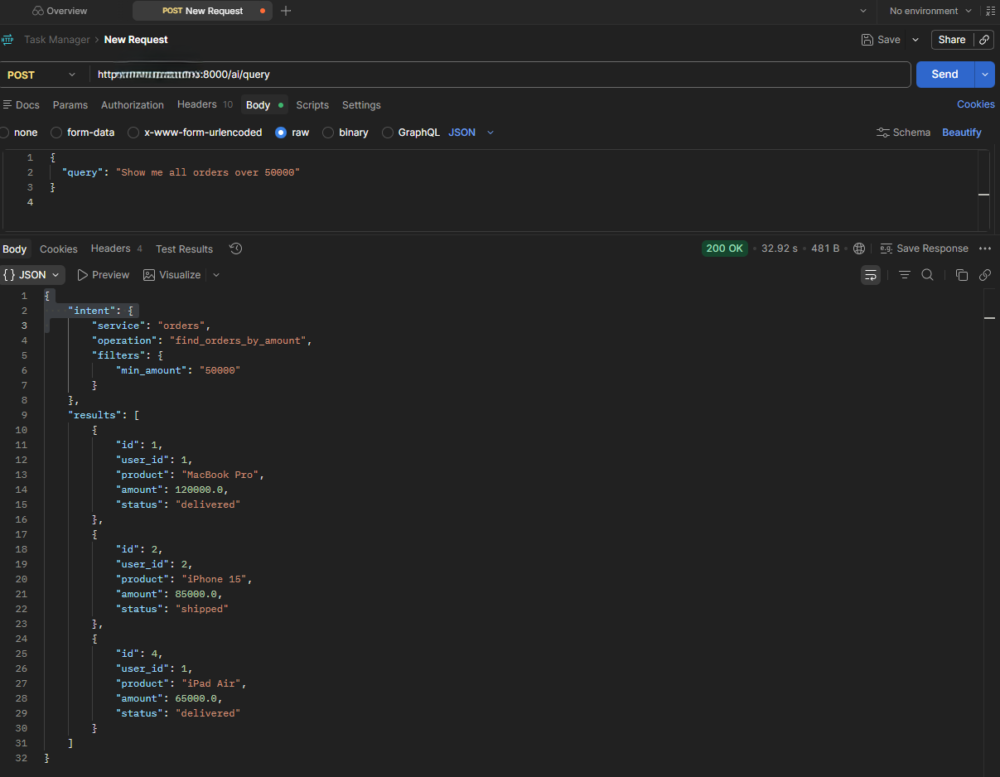
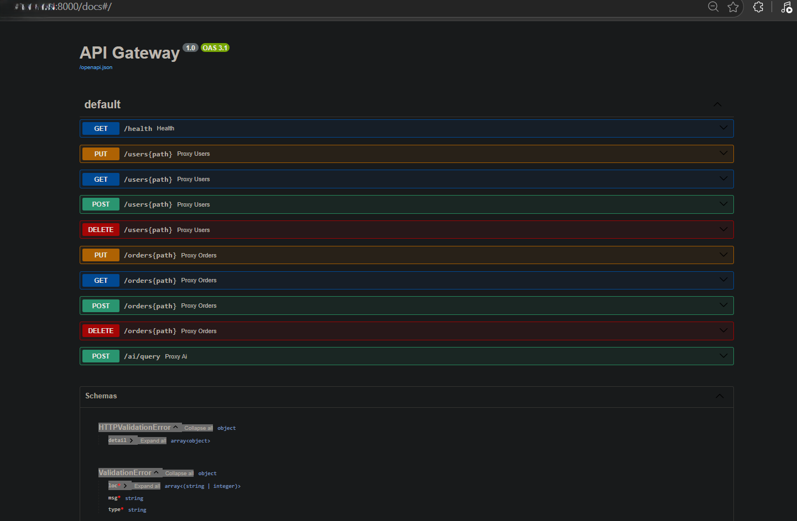

<div align="center">

# ☁️ Cloud-Native AI Microservices Platform

### *End-to-End DevOps — From Local Docker to Production AWS EKS*

[](https://www.python.org/)
[](https://fastapi.tiangolo.com/)
[](https://aws.amazon.com/eks/)
[](https://www.terraform.io/)
[](https://www.docker.com/)
[](https://github.com/features/actions)
[](https://helm.sh/)
[](https://trivy.dev/)

> **A fully production-grade portfolio project** — 4 Python microservices containerized with Docker, orchestrated on AWS EKS with Terraform, deployed automatically via a GitOps CI/CD pipeline with security scanning, all backed by an AI-powered natural language query engine.

</div>

---

## 🎯 What This Project Demonstrates


| Skill Area | What I Built |
|:---|:---|
| **Infrastructure as Code** | Provisioned 61 AWS resources (VPC, EKS, RDS, ECR) from scratch using Terraform modules with remote state in S3 + DynamoDB locking |
| **CI/CD Automation** | Zero-touch deployment pipeline: code push → parallel test → Trivy CVE scan → ECR push → Helm upgrade on EKS |
| **Security Engineering** | Keyless AWS authentication via OIDC federation; automated container vulnerability scanning that blocks deploys on critical CVEs |
| **Kubernetes Orchestration** | HPA, Helm packaging, AWS ALB Ingress, ClusterIP service mesh, automated DB migrations via Helm hooks (`pre-install` Jobs) |
| **Cloud Cost Optimization** | EKS Spot Instance node group to reduce compute costs without sacrificing availability |
| **Observability & Reliability** | PostgreSQL connection pooling (`psycopg2.pool`) + Redis caching layer to eliminate connection exhaustion and reduce DB read latency |
| **AI Integration** | Natural language query engine powered by a locally hosted Llama 3.2 model via Ollama, running on a VPC-internal EC2 instance |

---

## 🏗️ Architecture Overview

### Production — AWS EKS

```
Internet ──HTTPS──▶ AWS ALB Ingress
                          │
                    ┌─────┴──────────────────────────────────────┐
                    │         AWS EKS Cluster (Production NS)     │
                    │                                             │
                    │    API Gateway (:8000)                      │
                    │      ├──▶ User Service    ──▶ RDS Postgres  │
                    │      ├──▶ Order Service   ──▶ RDS Postgres  │
                    │      │         └────────────▶ Redis Cache   │
                    │      └──▶ AI Service ─────────────────────┐ │
                    └───────────────────────────────────────────│─┘
                                                                │
                    EC2 Jumpbox (VPC-internal)                  │
                    └──▶ Ollama / Llama 3.2 ◀───────────────────┘
```

### Local Development — Docker Compose

The entire stack — microservices, PostgreSQL, Redis, and the Llama 3.2 AI model — spins up with a **single command**, ensuring environment parity with production.

---

## 🛠️ Technology Stack

| Layer | Technology |
|:---|:---|
| **Cloud** | Amazon Web Services (AWS) — `ap-south-1` |
| **IaC** | Terraform `~> 5.0` with S3 remote state & DynamoDB locking |
| **Containers** | Docker, Docker Compose |
| **Orchestration** | AWS EKS `v1.36` · Helm `v3` · AWS ALB Ingress Controller |
| **CI/CD** | GitHub Actions (parallel matrix build + GitOps deploy) |
| **Security** | AWS OIDC Federation · Trivy container scanning (SARIF upload) |
| **Backend** | Python `3.11` · FastAPI `0.103` |
| **Databases** | AWS RDS PostgreSQL `15` · Redis `7` (in-cluster) |
| **AI Engine** | Ollama · `llama3.2:1b` · Natural language → SQL |
| **Registry** | Amazon ECR (4 private repositories) |

---

## 🚀 Live Proof — Screenshots

### ✅ CI/CD Pipeline — All Checks Passing

*5 parallel jobs (4 microservice CI + 1 deploy) — all green. Pipeline runs in under 3 minutes.*


---

### ✅ Helm Deploy to EKS — Step-by-Step

*Deploy job: OIDC auth → kubeconfig update → DB secret injection → `helm upgrade` → rollout verification.*


---

### ✅ Kubernetes Pods — All Running in Production

*9 pods live in the `production` namespace — all microservices at `1/1 READY`, DB migration Job `Completed` cleanly.*


---

### ✅ Terraform Apply — 61 AWS Resources Provisioned

*`Apply complete! Resources: 61 added, 0 changed, 0 destroyed.` — Full VPC, EKS Spot node group, RDS endpoint, and ECR registry provisioned via IaC.*


---

### ✅ Amazon ECR — 4 Private Repositories

*All microservice images stored in private ECR repositories, auto-pushed by the CI/CD pipeline on every `main` branch push.*


---

### ✅ AI Natural Language Query Engine — Live

*POST `/ai/query` with plain English: `"Show me all orders over 50000"` → Llama 3.2 parses intent → queries PostgreSQL → returns structured results. `200 OK`.*



---

### ✅ Local Dev — Interactive API Docs

*FastAPI's auto-generated Swagger UI at `localhost:8000/docs` — all microservice endpoints documented and testable instantly.*



---

### ✅ Docker Compose — Full Stack Running Locally

*All services healthy via `docker compose ps`. Local environment mirrors production perfectly.*


---

## 🔄 CI/CD Pipeline Deep Dive

```
git push ──▶ main
              │
    ┌─────────▼──────────────────────────────────────────────────┐
    │  PARALLEL MATRIX (4 jobs run simultaneously)               │
    │                                                             │
    │  ci (api-gateway)   ──▶ pytest ──▶ ECR push ──▶ Trivy scan │
    │  ci (user-service)  ──▶ pytest ──▶ ECR push ──▶ Trivy scan │
    │  ci (order-service) ──▶ pytest ──▶ ECR push ──▶ Trivy scan │
    │  ci (ai-service)    ──▶ pytest ──▶ ECR push ──▶ Trivy scan │
    └─────────────────────────────┬───────────────────────────────┘
                                  │  (all 4 must pass)
                        ┌─────────▼─────────────────┐
                        │  DEPLOY JOB                │
                        │  OIDC → kubeconfig update  │
                        │  Inject DB secret          │
                        │  helm upgrade --atomic     │
                        │  Verify all rollouts       │
                        └────────────────────────────┘
```

**Key design decisions:**
- **OIDC over static keys** — GitHub Actions federates with AWS IAM using short-lived tokens. No `AWS_SECRET_ACCESS_KEY` ever stored in secrets.
- **`--atomic` Helm flag** — If any pod fails health checks, the deployment auto-rolls back. Zero manual intervention.
- **Trivy SARIF upload** — Vulnerability reports are uploaded directly to GitHub Security tab for audit trails.

---

## ⚡ Quick Start (Local)

> *Requires Docker Desktop v24+ and ~8GB RAM*

```bash
# 1. Clone
git clone <repo-url>
cd microservices-platform

# 2. Bootstrap everything (pulls images, seeds DB, starts all services)
bash scripts/setup.sh

# 3. Test the AI query engine
curl -s -X POST http://localhost:8000/ai/query \
  -H 'Content-Type: application/json' \
  -d '{"query": "Show me all orders over 5000"}'

# 4. Open Swagger UI
open http://localhost:8000/docs
```

---

## ☁️ Cloud Deployment (AWS EKS)

For the complete Terraform provisioning walkthrough and OIDC pipeline setup, see the **[Run Guide & Runbook](./RUN_GUIDE.md)**.

**Prerequisites:** AWS CLI configured, Terraform `1.6+`, `kubectl`, `helm`

```bash
# Provision infrastructure
cd terraform/
terraform init
terraform apply   # Provisions 61 resources

# Pipeline deploys automatically on push to main
git push origin main
```

---

## 📂 Repository Structure

```
microservices-platform/
├── .github/
│   └── workflows/
│       └── deploy.yaml          # Full CI/CD pipeline (matrix + deploy)
│
├── api-gateway/                 # FastAPI entrypoint — routes all traffic
├── ai-service/                  # NL query engine — Llama 3.2 via Ollama
├── user-service/                # User CRUD — PostgreSQL + connection pooling
├── order-service/               # Order logic — PostgreSQL + Redis cache
│
├── terraform/                   # AWS IaC
│   ├── modules/vpc/             # Custom VPC, subnets, IGW
│   ├── modules/eks/             # EKS cluster + Spot node group
│   ├── modules/rds/             # RDS PostgreSQL instance
│   └── modules/ecr/             # 4 ECR repositories
│
├── helm/ai-platform/            # Unified Helm chart for all services
│   └── templates/
│       ├── redis/               # In-cluster Redis deployment
│       └── db-init-job.yaml     # Helm pre-install hook (DB migration)
│
├── scripts/
│   ├── setup.sh                 # Local bootstrap script
│   └── eks-setup.sh             # ALB controller IAM setup
│
└── screenshots/                 # Live proof — pipeline, pods, infra
```

---

## 🧩 Engineering Challenges Solved

These are real problems I debugged and solved during this project:

| Challenge | Root Cause | Solution |
|:---|:---|:---|
| **ALB Controller no permissions** | EKS worker nodes missing IAM policy | Dynamically attached the required policy via `eks-setup.sh` using the OIDC provider ARN |
| **DB migration ran twice** | Helm re-ran the `pre-install` Job on redeploy | Made `init.sql` fully idempotent with `INSERT WHERE NOT EXISTS` guards |
| **Helm resource conflict** | Manual `kubectl apply` resources conflicted with Helm ownership | Deleted orphaned resources and re-created as proper Helm-managed templates |
| **LLM unreachable from EKS** | Ollama running on EC2, EKS pods in private subnet | Exposed port `11434` on EC2 via `0.0.0.0`, secured with AWS Security Group rules allowing only EKS CIDR |
| **DB connection exhaustion** | Each FastAPI request opened a new connection | Implemented `psycopg2.ThreadedConnectionPool` with min/max bounds — dramatically reduced latency |

---

## 📊 Project Metrics at a Glance

| Metric | Value |
|:---|:---|
| AWS Resources provisioned via Terraform | **61** |
| Microservices deployed | **4** |
| CI/CD pipeline duration | **~3 minutes** |
| ECR private repositories | **4** |
| Kubernetes pods in production | **9** (incl. DB init Job) |
| Infrastructure environments | **2** (Local Docker Compose + AWS EKS) |

---

